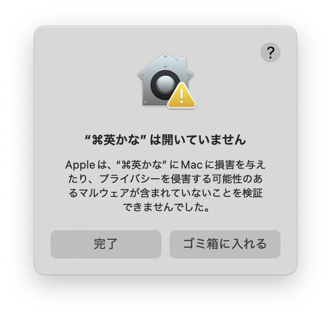
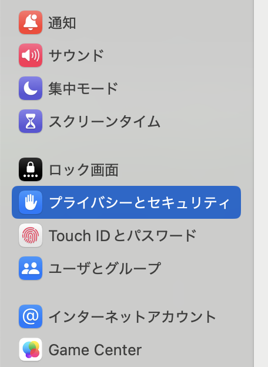
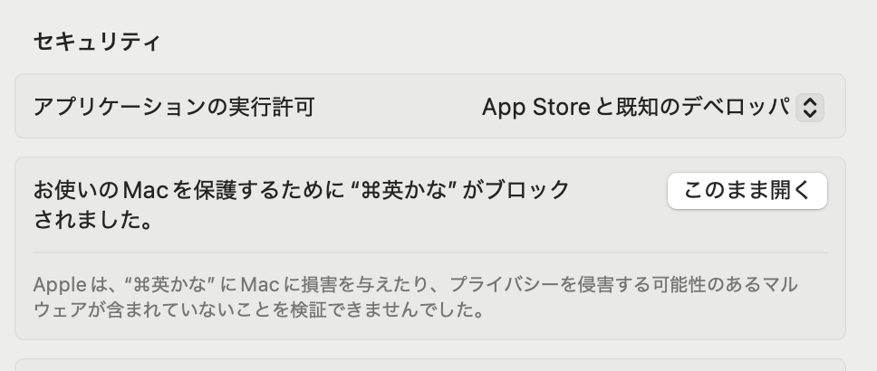
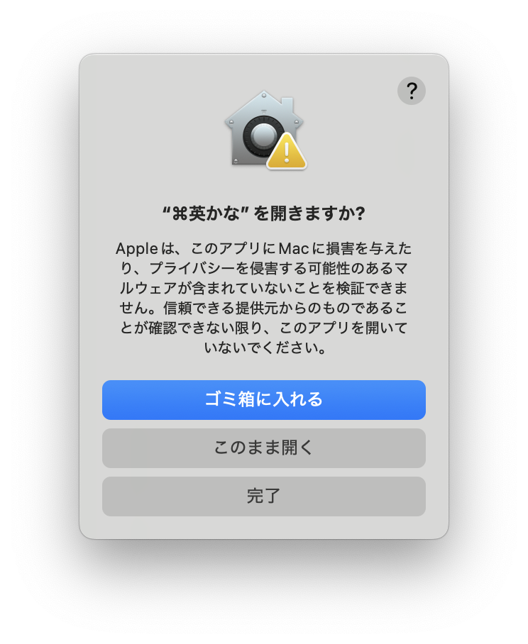
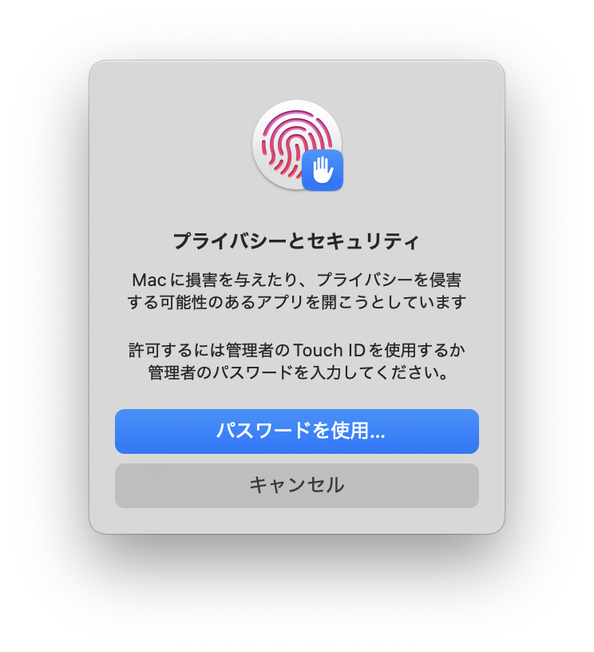

  
  <h1 style="margin: 0;">cmd-eikana - Apple Silicon版</h1>

macOSで左右のコマンドキーを単体で押したときに英数/かなを切り替えるユーティリティです。USキーボードでもJISキーボードの「英数」「かな」キーと同様の操作感を実現できます。

本アプリケーションは [iMasanari/cmd-eikana](https://github.com/iMasanari/cmd-eikana) をApple Silicon向けにフォークしたものです。オリジナル版の詳細な説明は[公式サイト](https://ei-kana.appspot.com/)をご覧ください。

---

## 差分の確認

- [オリジナル版との差分](https://github.com/iMasanari/cmd-eikana/compare/master...glyzinie:cmd-eikana:main)
- [dominion525版との差分](https://github.com/dominion525/cmd-eikana/compare/master...glyzinie:cmd-eikana:main)
- [オリジナル版とdominion525版の差分](https://github.com/iMasanari/cmd-eikana/compare/master...dominion525:cmd-eikana:master)

---

## ダウンロード

  <a href="https://github.com/glyzinie/cmd-eikana/releases/latest" style="display: inline-flex; align-items: center; background: #4a90d9; color: white; text-decoration: none; padding: 12px 24px; border-radius: 8px; font-size: 1.1em;">
    Download cmd-eikana-v0.0.1
    macOS 26.0+ / Apple Silicon
  </a>
  

    <a href="https://github.com/glyzinie/cmd-eikana">View project on GitHub</a>
  

---

## キーバインド

| 入力 | 出力 | 備考 |
|:-----|:-----|:-----|
| 左⌘（単押し） | 英数 | 他のキーと組み合わせない場合 |
| 右⌘（単押し） | かな | 他のキーと組み合わせない場合 |
| ⌘ + 他のキー | 通常動作 | ショートカットとして機能 |

コマンドキーを単独で押して離したときに入力切り替えが発動します。⌘+C や ⌘+V などのショートカットは通常通り使用できます。

---

## 初回起動時の設定

本アプリは未署名のため、macOSのGatekeeperによってブロックされます。以下の手順で開いてください。

### 1. アプリを開く

cmd-eikana.appをダブルクリックすると、以下のダイアログが表示されます。

{: width="50%"}

ここでは「**完了**」をクリックしてください。

### 2. システム設定から許可する

システム設定を開き、「**プライバシーとセキュリティ**」を選択します。下にスクロールすると、「"cmd-eikana"がブロックされました」というメッセージが表示されています。「**このまま開く**」ボタンをクリックしてください。

  
  

### 3. 確認ダイアログ

「cmd-eikanaを開きますか？」というダイアログが表示されます。「**このまま開く**」をクリックしてください。

{: width="50%"}

### 4. 認証

Touch IDまたはパスワードで認証を求められます。認証してください。

{: width="50%"}

### 5. アクセシビリティの許可

アプリが起動すると、アクセシビリティの許可を求められます。システム設定の「プライバシーとセキュリティ」→「アクセシビリティ」でcmd-eikanaを許可してください。

---

## オリジナル版からの移行

オリジナル版（iMasanari/cmd-eikana）から移行する場合、Bundle IDが異なるためアクセシビリティの設定が競合することがあります。

1. オリジナル版のcmd-eikanaを終了
2. システム設定 →「プライバシーとセキュリティ」→「アクセシビリティ」を開く
3. 古いcmd-eikanaのエントリを削除（-ボタン）
4. 本フォーク版を起動し、新しくアクセシビリティを許可

---

## 終了方法

右上のステータスバーにある「⌘」アイコンをクリックし、「Quit」を選びます。

## アンインストール

cmd-eikana.appをゴミ箱に入れてください。設定ファイル `~/Library/Preferences/io.github.glyzinie.cmd-eikana.plist` も削除すると完全にアンインストールできます。

---

## クレジット

- オリジナル版: [iMasanari/cmd-eikana](https://github.com/iMasanari/cmd-eikana)
- オリジナル公式サイト: [https://ei-kana.appspot.com/](https://ei-kana.appspot.com/)
- Fork Maintainer: [dominion525](https://github.com/dominion525)
- Fork Maintainer: [Wis (Glyzinie)](https://github.com/glyzinie)

## ライセンス

MIT License

- Copyright (c) 2016 iMasanari
- Copyright (c) 2025 Dominion525
- Copyright (c) 2026 Wis
